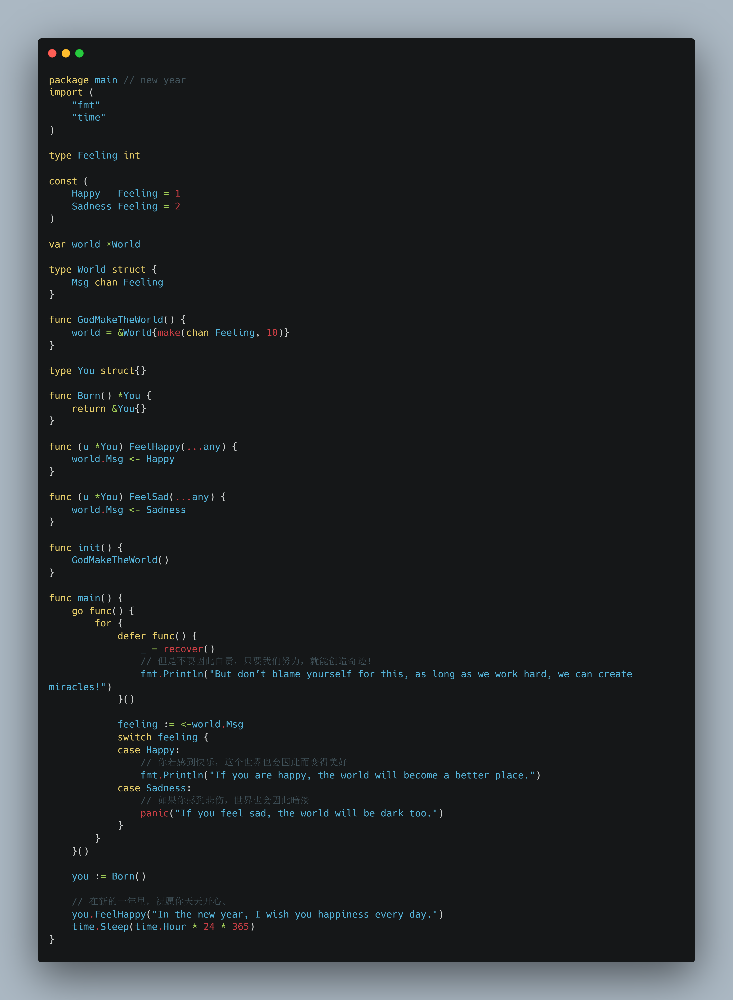

# 2025元旦快乐
这是一个祝福2025年元旦的仓库。

在此，我用我熟悉的语言`GoLang`为大家写下元旦的祝福。

祝愿大家前程似锦，美好未来。

## 贺词
在新的一年里，祝愿你天天开心。

你若感到快乐，这个世界也会因此而变得美好。

如果你感到悲伤，世界也会因此暗淡。

但是不要因此自责，只要我们努力，就能创造奇迹！

## 许可（License）
本项目使用[MIT LICENSE](./LICENSE)许可证发布。

MIT License: [mit-license.org](https://mit-license.org/)

## 鸣谢
感谢Jetbrains AI Assistant（中国大陆版）为本项目提供了AI（人工智能）技术支持。

感谢Google Translate提供的英文翻译支持。

感谢Carbon提供的代码图片生成服务。

感谢Github平台为本项目提供了代码托管服务。

**特别鸣谢本人所有项目的所有贡献者和贡献团体对本人的支持，你可以从PR记录、Commit记录中查看到他们的名字和贡献。**
